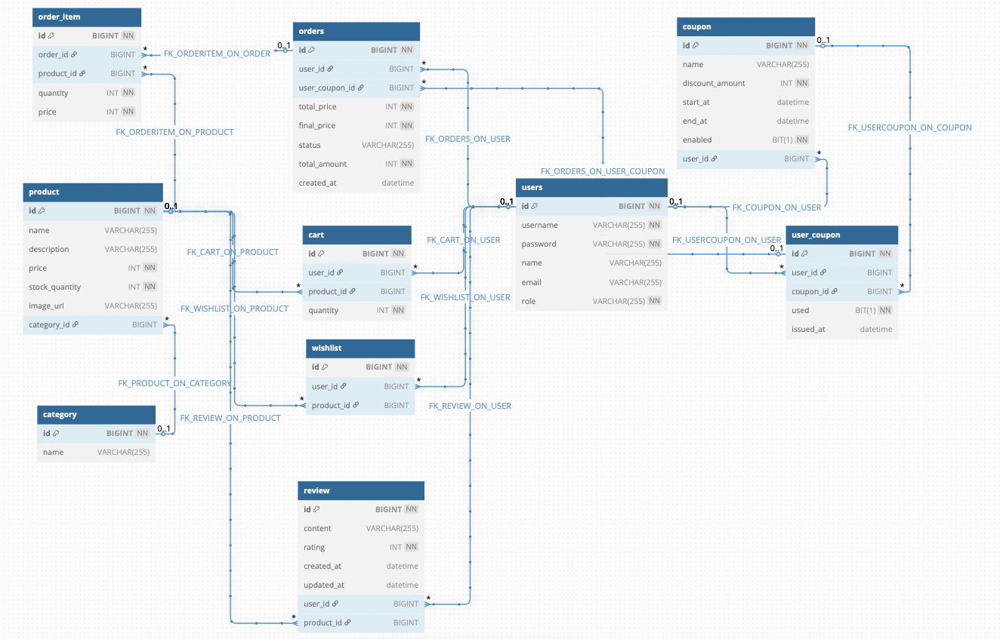

# 🛒 쇼핑몰 프로젝트

이 프로젝트는 Spring Boot를 기반으로 제작된 쇼핑몰 백엔드 애플리케이션입니다. 사용자 인증부터 제품 관리, 주문, 쿠폰 기능까지 쇼핑몰의 전반적인 기능을 구현합니다.

---

## 개발 기간
- 2025.04.23~2025.05.07

## ✨주요 기능

- 🧑 사용자 관리
  - JWT 기반 로그인 및 회원가입
  - 사용자 정보 조회 및 수정
- 📦 제품 관리
  - 사용자용 제품 목록 조회 및 상세 페이지
- 🔍 제품 검색
  - 카테고리, 가격 범위 등 다양한 조건으로 필터링
- ✍️ 리뷰 기능
  - 구매한 상품에 대한 리뷰 작성 및 관리
- 🎟️ 쿠폰 시스템 
  - 쿠폰 발급 및 적용 (1회 사용 제한)
  - 사용자별 쿠폰 사용 내역 관리
- 📊 관리자 대시보드 
  - 판매 추세, 일간 주문 통계, 카테고리별 수익 등 확인 
  - 사용자/카테고리/제품 관리 UI 제공
- 📦 주문 관리
  - 주문 생성, 주문 내역 조회, 주문 상태 확인
  
---

## 🛠 사용 기술

### 🔙 Backend
- java 17
- Spring Boot (3.4.4)
- Spring Data JPA (Hibernate)
- Spring Security
- **데이터베이스**: MySQL
- **보안**: JWT 인증
- **주요 의존성**:
    - Spring Boot Starter: `spring-boot-starter-data-jpa`, `spring-boot-starter-validation`, `spring-boot-starter-web`, `spring-boot-starter-security`
    - JWT: `jjwt-api`, `jjwt-impl`, `jjwt-jackson`
    - MySQL 커넥터: `mysql-connector-j`
    - Lombok을 사용하여 Java 코드 간소화
  
---

## 📁 디렉토리 구조
<pre>
├───────
│   │    │── src                    
│   │       ├── main                        
│   │       │   └── java             
│   │       │        └── com.shop            
│   │       │            ├── controller          
│   │       │            │   ├── admin
│   │       │            │   │   ├── AdminCategoryController.class
│   │       │            │   │   ├── AdminCouponController.class
│   │       │            │   │   ├── AdminDashboardController.class
│   │       │            │   │   ├── AdminOrderController.class
│   │       │            │   │   ├── AdminProductController.class
│   │       │            │   │   ├── AdminReviewController.class
│   │       │            │   │   └── AdminUserController.class
│   │       │            │   ├── cart
│   │       │            │   │   └── CartController.class
│   │       │            │   ├── category
│   │       │            │   │   └── CategoryController.class
│   │       │            │   ├── coupon
│   │       │            │   │   └── UserCouponController.class
│   │       │            │   ├── order
│   │       │            │   │   └── OrderController.class
│   │       │            │   ├── product
│   │       │            │   │   └── ProductController.class
│   │       │            │   ├── review
│   │       │            │   │   └── ReviewController.class
│   │       │            │   ├── user
│   │       │            │   │   └── UserController.class
│   │       │            │   └── wishlist
│   │       │            │       └── WishListController.class
│   │       │            ├── dto
│   │       │            │   ├── admin
│   │       │            │   │   ├── CategoryRevenueDto.class
│   │       │            │   │   ├── DailyOrderDto.class
│   │       │            │   │   └── DashboardResponseDto.class
│   │       │            │   ├── cart
│   │       │            │   │   ├── CartRequestDto.class
│   │       │            │   │   └── CartResponseDto.class
│   │       │            │   ├── category
│   │       │            │   │   ├── CategoryRequestDto.class
│   │       │            │   │   └── CategoryResponseDto.class
│   │       │            │   ├── coupon
│   │       │            │   │   ├── CouponRequestDto.class
│   │       │            │   │   ├── CouponResponseDto.class
│   │       │            │   │   └── UserCouponResponseDto.class
│   │       │            │   ├── order
│   │       │            │   │   ├── OrderItemRequestDto.class
│   │       │            │   │   ├── OrderItemResponseDto.class
│   │       │            │   │   ├── OrderRequestDto.class
│   │       │            │   │   └── OrderResponseDto.class
│   │       │            │   ├── product
│   │       │            │   │   ├── ProductRequestDto.class
│   │       │            │   │   └── ProductResponseDto.class
│   │       │            │   ├── review
│   │       │            │   │   ├── ReviewRequestDto.class
│   │       │            │   │   └── ReviewResponseDto.class
│   │       │            │   ├── user
│   │       │            │   │   ├── LoginRequestDto.class
│   │       │            │   │   ├── UserRequestDto.class
│   │       │            │   │   └── UserResponseDto.class
│   │       │            │   └── wishlist
│   │       │            │       └── WishListResponseDto.class
│   │       │            ├── entity
│   │       │            │   ├── cart
│   │       │            │   │   └── Cart.class
│   │       │            │   ├── category
│   │       │            │   │   └── Category.class
│   │       │            │   ├── coupon
│   │       │            │   │   ├── Coupon.class
│   │       │            │   │   └── UserCoupon.class
│   │       │            │   ├── order
│   │       │            │   │   ├── Order.class
│   │       │            │   │   ├── OrderItem.class
│   │       │            │   │   └── OrderStatus.class
│   │       │            │   ├── product
│   │       │            │   │   └── Product.class
│   │       │            │   ├── review
│   │       │            │   │   └── Review.class
│   │       │            │   ├── user
│   │       │            │   │   ├── Role.class
│   │       │            │   │   └── User.class
│   │       │            │   └── wishlist
│   │       │            │       └── WishList.class
│   │       │            ├── exception
│   │       │            │   ├── cart
│   │       │            │   │   └── CartNotFoundException.class
│   │       │            │   ├── category
│   │       │            │   │   └── CategoryNotFoundException.class
│   │       │            │   ├── coupon
│   │       │            │   │   └── CouponNotFoundException.class
│   │       │            │   ├── dto
│   │       │            │   │   └── ErrorResponse.class
│   │       │            │   ├── GlobalExceptionHandler.class
│   │       │            │   ├── order
│   │       │            │   │   ├── OrderAccessDeniedException.class
│   │       │            │   │   └── OrderNotFoundException.class
│   │       │            │   ├── product
│   │       │            │   │   └── ProductNotFoundException.class
│   │       │            │   ├── review
│   │       │            │   │   └── ReviewNotFoundException.class
│   │       │            │   ├── user
│   │       │            │   │   └── UserNotFoundException.class
│   │       │            │   └── wishlist
│   │       │            │       └── WishListNotFoundException.class
│   │       │            ├── repository
│   │       │            │   ├── cart
│   │       │            │   │   └── CartRepository.class
│   │       │            │   ├── category
│   │       │            │   │   └── CategoryRepository.class
│   │       │            │   ├── coupon
│   │       │            │   │   ├── CouponRepository.class
│   │       │            │   │   └── UserCouponRepository.class
│   │       │            │   ├── order
│   │       │            │   │   └── OrderRepository.class
│   │       │            │   ├── product
│   │       │            │   │   └── ProductRepository.class
│   │       │            │   ├── review
│   │       │            │   │   └── ReviewRepository.class
│   │       │            │   ├── user
│   │       │            │   │   └── UserRepository.class
│   │       │            │   └── wishlist
│   │       │            │       └── WishListRepository.class
│   │       │            ├── security
│   │       │            │   ├── JwtAuthenticationFilter.class
│   │       │            │   ├── JwtUtil.class
│   │       │            │   └── SecurityConfig.class
│   │       │            ├── service
│   │       │            │   ├── admin
│   │       │            │   │   ├── AdminCategoryService.class
│   │       │            │   │   ├── AdminCouponService.class
│   │       │            │   │   ├── AdminDashboardService.class
│   │       │            │   │   ├── AdminOrderService.class
│   │       │            │   │   ├── AdminProductService.class
│   │       │            │   │   ├── AdminReviewService.class
│   │       │            │   │   └── AdminUserService.class
│   │       │            │   ├── cart
│   │       │            │   │   └── CartService.class
│   │       │            │   ├── category
│   │       │            │   │   └── CategoryService.class
│   │       │            │   ├── coupon
│   │       │            │   │   └── UserCouponService.class
│   │       │            │   ├── order
│   │       │            │   │   └── OrderService.class
│   │       │            │   ├── product
│   │       │            │   │   ├── ProductService.class
│   │       │            │   │   └── ProductSpecs.class
│   │       │            │   ├── review
│   │       │            │   │   └── ReviewService.class
│   │       │            │   ├── user
│   │       │            │   │   └── UserService.class
│   │       │            │   └── wishlist
│   │       │            │       └── WishListService.class
│   │       │            └── ShopApplication.class
│   │       │
│   │       ├── resources
│   │       │   ├── static
│   │       │   ├── templates
│   │       │   └── application.yml    
</pre>

---

## 📌 ERD

---

## 📄 APIs (USER)

### 🧑 User API 

| Method | Endpoint                  | Description           |
|--------|---------------------------|-----------------------|
| POST   | `/api/users/signup`       | 일반 사용자 회원가입    |
| POST   | `/api/users/signup/admin` | 관리자 회원가입         |
| POST   | `/api/users/login`        | 로그인 (토큰 발급)     |
| GET    | `/api/users`              | 전체 사용자 조회       |
| GET    | `/api/users/{id}`         | 사용자 ID로 조회       |
| PUT    | `/api/users/{id}`         | 사용자 정보 수정       |
| DELETE | `/api/users/{id}`         | 사용자 삭제           |

### 📦 Product API

| HTTP Method | Endpoint                          | Description                   |
|-------------|-----------------------------------|-------------------------------|
| GET         | `/api/products        `             | 전체 상품 조회                |
| GET         | `/api/products/{id}    `            | 단일 상품 조회                |
| GET         | `/api/products/search   `           | 상품 검색 및 필터링           |
| GET         | `/api/products/popular/wishlist`    | 인기 상품 조회 (찜 순)        |
| GET         | `/api/products/popular/order    `   | 인기 상품 조회 (주문 많은 순) |

### 🏠 Order API

| HTTP Method | Endpoint              | Description           | Authorization |
|-------------|-----------------------|-----------------------|----|
| POST        | `/api/orders        `   | 주문 생성             | ✅ |
| GET         | `/api/orders/{id}  `    | 주문 단건 조회        | ✅ |
| GET         | `/api/orders/my   `     | 내 주문 목록 조회     | ✅ |
| PUT         | `/api/orders/{id}`      | 주문 취소             | ✅ |

### 🛒Cart API

| HTTP Method | Endpoint           | Description                    | Authorization |
|-------------|--------------------|--------------------------------|----|
| POST        | `/api/carts  `       | 장바구니 추가 또는 수량 수정   | ✅ |
| GET         | `/api/carts   `      | 로그인한 사용자의 장바구니 조회| ✅ |
| DELETE      | `/api/carts/{id}`    | 장바구니 항목 삭제             | ❌ |

### ❤️ WishList API

| HTTP Method | Endpoint                | Description           | Authorization |
|-------------|-------------------------|-----------------------|---------|
| POST        | `/api/wishlist   `        | 찜 추가               | ✅     |
| DELETE      | `/api/wishlist/{id}`      | 찜 삭제               | ✅     |
| GET         | `/api/wishlist      `     | 내 찜 목록 조회       | ✅     |

### ✍️ Review API

| HTTP Method | Endpoint                      | Description              | Authorization |
|-------------|-------------------------------|--------------------------|----|
| POST        | `/api/reviews`                  | 리뷰 작성                | ✅  |
| PUT         | `/api/reviews/{id}`             | 리뷰 수정                | ✅  |
| DELETE      | `/api/reviews/{id}`             | 리뷰 삭제                | ✅  |
| GET         | `/api/reviews/product/{id}`     | 특정 상품 리뷰 조회      | ❌  |
| GET         | `/api/reviews/me`               | 내 리뷰 목록 조회        | ✅  |

### 🎟️ UserCoupon API

| HTTP Method | Endpoint                              | Description         | Authorization |
|-------------|----------------------------------------|---------------------|------------|
| GET         | `/api/user/coupons     `                | 내 쿠폰 목록 조회   | ✅        |
| POST        | `/api/user/coupons/{userCouponId}/use` | 쿠폰 사용 요청      | ✅        |

### 📘 Category API

| Method | Endpoint              |
|--------|-----------------------|
| GET    | `/api/categories`      |
| GET    | `/api/categories/{id}` |
---
## 📄 APIs (ADMIN)
- 관리자(Admin)용 API는 /api/admin/** 경로를 기반으로 구성되어 있으며, ROLE_ADMIN 권한이 있어야 접근 가능합니다.

### 👤 Admin User API

| Method | Endpoint                | Description         |
|--------|-------------------------|---------------------|
| GET    | `/api/admin/users`      | 전체 회원 조회        |
| DELETE | `/api/admin/users/{id}` | 회원 삭제 (ID 기반)  |

### 📦 Admin Product API

| Method | Endpoint                      | Description                      |
|--------|-------------------------------|----------------------------------|
| GET    | `/api/admin/products`         | 전체 상품 조회                    |
| POST   | `/api/admin/products`         | 상품 등록 (쿼리파라미터로 categoryId 전달) |
| PUT    | `/api/admin/products/{id}`    | 상품 수정 (쿼리파라미터로 categoryId 전달) |
| DELETE | `/api/admin/products/{id}`    | 상품 삭제                         |

### 🏠 Admin Order API

| Method | Endpoint                    | Description     |
|--------|-----------------------------|-----------------|
| GET    | `/api/admin/orders`         | 전체 주문 조회  |
| DELETE | `/api/admin/orders/{id}`    | 주문 삭제       |

### 📝 Admin Review API

| Method | Endpoint                     | Description      |
|--------|------------------------------|------------------|
| GET    | `/api/admin/reviews`         | 전체 리뷰 조회   |
| DELETE | `/api/admin/reviews/{id}`    | 특정 리뷰 삭제   |

### 📊 Admin Dashboard API

| Method | Endpoint                   | Description                |
|--------|----------------------------|----------------------------|
| GET    | `/api/admin/dashboard`     | 관리자 대시보드 통계 조회 |

### 🎟️ Admin Coupon API

| Method | Endpoint                                  | Description                     |
|--------|-------------------------------------------|---------------------------------|
| POST   | `/api/admin/coupons`                      | 쿠폰 등록                       |
| GET    | `/api/admin/coupons`                      | 전체 쿠폰 조회                  |
| PATCH  | `/api/admin/coupons/{id}/disable`         | 쿠폰 비활성화                   |
| POST   | `/api/admin/coupons/issue-to-all/{couponId}` | 전체 사용자에게 쿠폰 발급     |

### 🗂️ Admin Category API

| Method | Endpoint                        | Description        |
|--------|----------------------------------|--------------------|
| GET    | `/api/admin/categories`         | 전체 카테고리 조회 |
| POST   | `/api/admin/categories`         | 카테고리 등록      |
| PUT    | `/api/admin/categories/{id}`    | 카테고리 수정      |
| DELETE | `/api/admin/categories/{id}`    | 카테고리 삭제      |