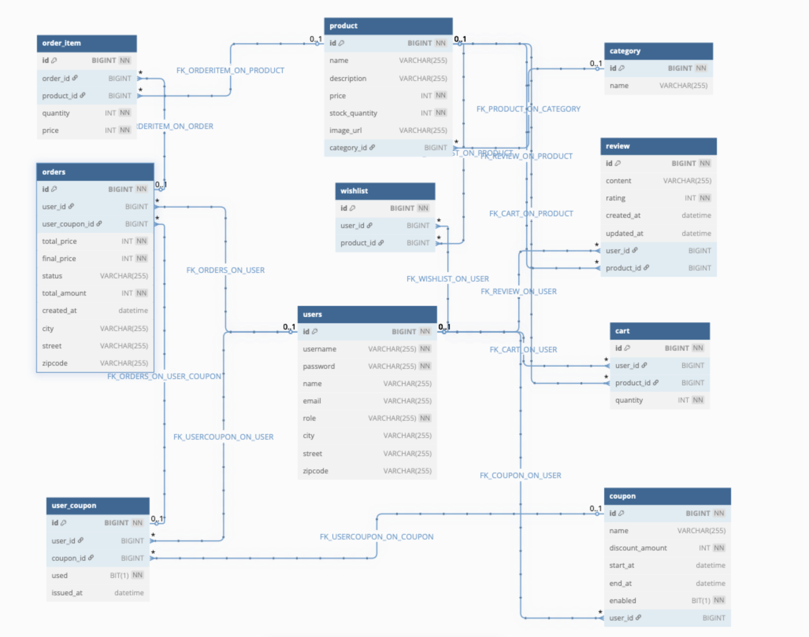

# 🛒 쇼핑몰 프로젝트
이 프로젝트는 Spring Boot를 기반으로 제작된 쇼핑몰 백엔드 애플리케이션입니다. 사용자 인증부터 제품 관리, 주문, 쿠폰 기능까지 쇼핑몰의 전반적인 기능을 구현합니다.

## 📌 주요 기능

- 🧑 사용자 관리
  - JWT 기반 로그인 및 회원가입
  - 사용자 정보 조회 및 수정
- 📦 제품 관리
  - 사용자용 제품 목록 조회 및 상세 페이지
- 🔍 제품 검색
  - 카테고리, 가격 범위 등 다양한 조건으로 필터링
- ✍️ 리뷰 기능
  - 구매한 상품에 대한 리뷰 작성 및 관리
- 🎟️ 쿠폰 시스템 
  - 쿠폰 발급 및 적용 (1회 사용 제한)
  - 사용자별 쿠폰 사용 내역 관리
- 📊 관리자 대시보드 
  - 판매 추세, 일간 주문 통계, 카테고리별 수익 등 확인 
  - 사용자/카테고리/제품 관리 UI 제공
- 📦 주문 관리
  - 주문 생성, 주문 내역 조회, 주문 상태 확인

## 🛠 사용 기술

### 🔙 Backend
- java 17
- Spring Boot (3.4.4)
- Spring Data JPA (Hibernate)
- Spring Security
- **데이터베이스**: MySQL
- **보안**: JWT 인증
- **주요 의존성**:
    - Spring Boot Starter: `spring-boot-starter-data-jpa`, `spring-boot-starter-validation`, `spring-boot-starter-web`, `spring-boot-starter-security`
    - JWT: `jjwt-api`, `jjwt-impl`, `jjwt-jackson`
    - MySQL 커넥터: `mysql-connector-j`
    - Lombok을 사용하여 Java 코드 간소화

## 디렉토리 구조
<pre>
├───────
│   │    │── src                    
│   │       ├── main                        
│   │       │   └── java             
│   │       │        └── com.shop            
│   │       │            ├── controller          
│   │       │            │   ├── admin
│   │       │            │   │   ├── AdminCategoryController.class
│   │       │            │   │   ├── AdminCouponController.class
│   │       │            │   │   ├── AdminDashboardController.class
│   │       │            │   │   ├── AdminOrderController.class
│   │       │            │   │   ├── AdminProductController.class
│   │       │            │   │   ├── AdminReviewController.class
│   │       │            │   │   └── AdminUserController.class
│   │       │            │   ├── cart
│   │       │            │   │   └── CartController.class
│   │       │            │   ├── category
│   │       │            │   │   └── CategoryController.class
│   │       │            │   ├── coupon
│   │       │            │   │   └── UserCouponController.class
│   │       │            │   ├── order
│   │       │            │   │   └── OrderController.class
│   │       │            │   ├── product
│   │       │            │   │   └── ProductController.class
│   │       │            │   ├── review
│   │       │            │   │   └── ReviewController.class
│   │       │            │   ├── user
│   │       │            │   │   └── UserController.class
│   │       │            │   └── wishlist
│   │       │            │       └── WishListController.class
│   │       │            ├── dto
│   │       │            │   ├── admin
│   │       │            │   │   ├── CategoryRevenueDto.class
│   │       │            │   │   ├── DailyOrderDto.class
│   │       │            │   │   └── DashboardResponseDto.class
│   │       │            │   ├── cart
│   │       │            │   │   ├── CartRequestDto.class
│   │       │            │   │   └── CartResponseDto.class
│   │       │            │   ├── category
│   │       │            │   │   ├── CategoryRequestDto.class
│   │       │            │   │   └── CategoryResponseDto.class
│   │       │            │   ├── coupon
│   │       │            │   │   ├── CouponRequestDto.class
│   │       │            │   │   ├── CouponResponseDto.class
│   │       │            │   │   └── UserCouponResponseDto.class
│   │       │            │   ├── order
│   │       │            │   │   ├── OrderItemRequestDto.class
│   │       │            │   │   ├── OrderItemResponseDto.class
│   │       │            │   │   ├── OrderRequestDto.class
│   │       │            │   │   └── OrderResponseDto.class
│   │       │            │   ├── product
│   │       │            │   │   ├── ProductRequestDto.class
│   │       │            │   │   └── ProductResponseDto.class
│   │       │            │   ├── review
│   │       │            │   │   ├── ReviewRequestDto.class
│   │       │            │   │   └── ReviewResponseDto.class
│   │       │            │   ├── user
│   │       │            │   │   ├── LoginRequestDto.class
│   │       │            │   │   ├── UserRequestDto.class
│   │       │            │   │   └── UserResponseDto.class
│   │       │            │   └── wishlist
│   │       │            │       └── WishListResponseDto.class
│   │       │            ├── entity
│   │       │            │   ├── cart
│   │       │            │   │   └── Cart.class
│   │       │            │   ├── category
│   │       │            │   │   └── Category.class
│   │       │            │   ├── coupon
│   │       │            │   │   ├── Coupon.class
│   │       │            │   │   └── UserCoupon.class
│   │       │            │   ├── order
│   │       │            │   │   ├── Order.class
│   │       │            │   │   ├── OrderItem.class
│   │       │            │   │   └── OrderStatus.class
│   │       │            │   ├── product
│   │       │            │   │   └── Product.class
│   │       │            │   ├── review
│   │       │            │   │   └── Review.class
│   │       │            │   ├── user
│   │       │            │   │   ├── Role.class
│   │       │            │   │   └── User.class
│   │       │            │   └── wishlist
│   │       │            │       └── WishList.class
│   │       │            ├── exception
│   │       │            │   ├── cart
│   │       │            │   │   └── CartNotFoundException.class
│   │       │            │   ├── category
│   │       │            │   │   └── CategoryNotFoundException.class
│   │       │            │   ├── coupon
│   │       │            │   │   └── CouponNotFoundException.class
│   │       │            │   ├── dto
│   │       │            │   │   └── ErrorResponse.class
│   │       │            │   ├── GlobalExceptionHandler.class
│   │       │            │   ├── order
│   │       │            │   │   ├── OrderAccessDeniedException.class
│   │       │            │   │   └── OrderNotFoundException.class
│   │       │            │   ├── product
│   │       │            │   │   └── ProductNotFoundException.class
│   │       │            │   ├── review
│   │       │            │   │   └── ReviewNotFoundException.class
│   │       │            │   ├── user
│   │       │            │   │   └── UserNotFoundException.class
│   │       │            │   └── wishlist
│   │       │            │       └── WishListNotFoundException.class
│   │       │            ├── repository
│   │       │            │   ├── cart
│   │       │            │   │   └── CartRepository.class
│   │       │            │   ├── category
│   │       │            │   │   └── CategoryRepository.class
│   │       │            │   ├── coupon
│   │       │            │   │   ├── CouponRepository.class
│   │       │            │   │   └── UserCouponRepository.class
│   │       │            │   ├── order
│   │       │            │   │   └── OrderRepository.class
│   │       │            │   ├── product
│   │       │            │   │   └── ProductRepository.class
│   │       │            │   ├── review
│   │       │            │   │   └── ReviewRepository.class
│   │       │            │   ├── user
│   │       │            │   │   └── UserRepository.class
│   │       │            │   └── wishlist
│   │       │            │       └── WishListRepository.class
│   │       │            ├── security
│   │       │            │   ├── JwtAuthenticationFilter.class
│   │       │            │   ├── JwtUtil.class
│   │       │            │   └── SecurityConfig.class
│   │       │            ├── service
│   │       │            │   ├── admin
│   │       │            │   │   ├── AdminCategoryService.class
│   │       │            │   │   ├── AdminCouponService.class
│   │       │            │   │   ├── AdminDashboardService.class
│   │       │            │   │   ├── AdminOrderService.class
│   │       │            │   │   ├── AdminProductService.class
│   │       │            │   │   ├── AdminReviewService.class
│   │       │            │   │   └── AdminUserService.class
│   │       │            │   ├── cart
│   │       │            │   │   └── CartService.class
│   │       │            │   ├── category
│   │       │            │   │   └── CategoryService.class
│   │       │            │   ├── coupon
│   │       │            │   │   └── UserCouponService.class
│   │       │            │   ├── order
│   │       │            │   │   └── OrderService.class
│   │       │            │   ├── product
│   │       │            │   │   ├── ProductService.class
│   │       │            │   │   └── ProductSpecs.class
│   │       │            │   ├── review
│   │       │            │   │   └── ReviewService.class
│   │       │            │   ├── user
│   │       │            │   │   └── UserService.class
│   │       │            │   └── wishlist
│   │       │            │       └── WishListService.class
│   │       │            └── ShopApplication.class
│   │       │
│   │       ├── resources
│   │       │   ├── static
│   │       │   ├── templates
│   │       │   └── application.yml    
</pre>

## ERD

